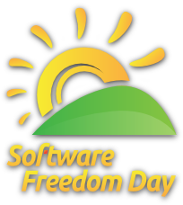

&nbsp;

    

        

        Alvatal on Eesti avatud lähtekoodiga ning vaba tarkvara
        tegemisi koondav katusorganisatsioon.
        

        

        <a class="btn btn-primary btn-lg" href="#" role="button">Meist ja meie tegemistest pikemalt &raquo;</a>
        

    

    

        

            <h2>Mis on Alvatal?</h2>
            

            Alvatal ühendab Eesti ette&shy;võtteid, mitte&shy;tulundus&shy;ühinguid ja vaba&shy;tahtlikke,
            kelle südame&shy;asjaks on läbi&shy;paistvus tark- ning riist&shy;vara&shy;lahenduste juures.
            Me peame oluliseks, et laia&shy;tarbe tark&shy;vara oleks avatud lähte&shy;koodiga,
            selleks et garanteerida tark&shy;vara kasutaja vabadus teenuse&shy;pakkuja
            valikul ning tagada tark&shy;vara lahenduste jätku&shy;suutlikus Eestis.
            Riist&shy;vara lahenduste puhul on olulised samad aspektid,
            et riistvara ei võimaldaks kolmandal osapoolel pealt kuulata
            kasutaja teksti&shy;vestlusi, e-kirju, heli- või videokõnesid.
             
            

            <a class="btn btn-default" href="#" role="button">Loe lähemalt &raquo;</a>

        

        

            <h2>Mida me pakume?</h2>
            

            Alvatali eesmärgiks on teavitada inimesi ja firmasid avatud
            lähte&shy;koodiga ja vaba tark&shy;vara võimalus&shy;test ning
            viia klient kokku teenuse&shy;pakkujaga.
            Me tutvus&shy;tame avatud lahendusi, mille abil on võimalik
            vähendada sõltuvust välis&shy;maistest teenuse&shy;pakkujatest ja seeläbi
            panustada kohaliku IKT-sektorisse.
            Me korraldame üritusi ees&shy;märgiga lähendada
            sarnaste väärtus&shy;hinnangute ning mõtte&shy;viisiga inimesi.
           
            
            
            

            <a class="btn btn-default" href="#" role="button">Üritused &raquo;</a>
            <a class="btn btn-default" href="business.html" role="button">Ettevõtted &raquo;</a>

        

        

            <h2>Kasu mulle?</h2>
            

            Kinnised lahendused on tavaliselt kaitstud tootja&shy;lukuga 
            ehk siis
            sõltuvus&shy;suhtega, mis takistab teil teisi tooteid kasutamast või
            teeb selle võimalikult eba&shy;mugavaks.
            Täna&shy;päeval on sama oht varitsemas veebis, kuna
            veebi&shy;teenuse pakkujale sisestatud infot on äärmiselt raske
            viia teise teenuse&shy;pakkuja juurde.
            See&shy;tõttu on olulised avatud lähte&shy;kood
            ja IKT-lahenduste rist-ühilduvus nii
            era&shy;isiku kui ette&shy;võtte jaoks, ees&shy;märgiga pikemas pers&shy;pek&shy;tiivis
            kulusid vähendada ning luua jätku&shy;suutelisi IKT-lahendusi.
            

            <a class="btn btn-default" href="http://kysi-mult-linuxit.alvatal.ee/" role="button">Tootjalukust lähemalt &raquo;</a>

        

    

      

        

          <h2>Talgud</h2>
          

          Seoses Windows XP tugiteenuse lõpuga korraldasime
          talgud 3. mail 2014 aastal Eesti erinevates linnades.
          
          Talgute eesmärk on aidata inimesi kelle arvutites töötab veel
          MS Windows XP, MS Office 2003 kuid mitte ainult – tere&shy;tulnud on
          kõik Microsofti tark&shy;vara kasutajad kes soovivad kasutada kaasaegset
          tark&shy;vara ning olla oluliselt paremini kaitstud pahavara, nuhkvara,
          reklaamvara vastu.
          Suure huvi tõttu korraldasime jätkutalgud 26. mail.
          Talgutel osales kokku umbes 300 murelikku kodanikku.
          

          

          
<a class="btn btn-default" href="#" role="button">Loe lähemalt &raquo;</a>

        

        

          <h2>Vaba Tarkvara Päev</h2>
          

          Korraldasime koostöös Riigi Infosüsteemide Ametiga
          Vaba Tarkvara Päeva 26. septembril 2014.
          
          Üritus osutus väga menukaks ning kohad täitusid esimeste päevade jooksul.

          

          
<a class="btn btn-default" href="#" role="button">Loe lähemalt &raquo;</a>

       

        

          <h2>Küsi mult Linuxit</h2>

          
Iga aasta septembris korraldame kampaaniat Küsi mult Linuxit. 
          
          Kampaania eesmärk on tuua välja põhjusi, miks sa võiksid mõnda
          Linuxi opsüsteemi kasutada, ja julgustada sind ka reaalselt Linuxit proovima.

          

          
          
          
<a class="btn btn-default" href="http://kysi-mult-linuxit.alvatal.ee/" role="button">Loe lähemalt &raquo;</a>

        

      

    

    

    

