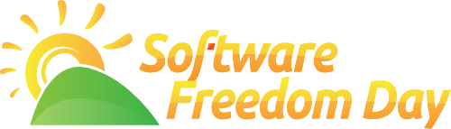

&nbsp;

    

        

        Alvatal on Eesti avatud lähtekoodiga ning vaba tarkvara
        tegemisi koondav katusorganisatsioon.
        

        

        <a class="btn btn-primary btn-lg" href="#" role="button">Meist ja meie tegemistest pikemalt &raquo;</a>
        

    

    

        

            <h2>Mis on Alvatal?</h2>
            

            Alvatal ühendab Eesti ettevõtteid, mittetulundusühinguid ja vabatahtlikke,
            kelle südameasjaks on läbipaistvus tark- ning riistvaralahenduste juures.
            Me peame oluliseks, et laiatarbe tarkvara oleks avatud lähtekoodiga,
            selleks et garanteerida tarkvara kasutaja vabadus teenusepakkuja
            valikul ning tagada tarkvara lahenduste jätkusuutlikus Eestis.
            Riistvara lahenduste puhul on olulised samad aspektid,
            et riistvara ei võimaldaks kolmandal osapoolel pealt kuulata
            kasutaja tekstivestlusi, e-kirju, heli- või videokõnesid.
             
            

            <a class="btn btn-default" href="#" role="button">Loe lähemalt &raquo;</a>

        

        

            <h2>Mida me pakume?</h2>
            

            Alvatali eesmärgiks on teavitada inimesi ja firmasid avatud
            lähtekoodiga ja vaba tarkvara võimalustest ning
            viia klient kokku teenusepakkujaga.
            Me tutvustame avatud lahendusi, mille abil on võimalik
            vähendada sõltuvust välismaistest teenusepakkujatest ja seeläbi
            panustada kohaliku IKT-sektorisse.
            Me korraldame üritusi eesmärgiga lähendada
            sarnaste väärtushinnangute ning mõtteviisiga inimesi.
           
            
            
            

            <a class="btn btn-default" href="#" role="button">Loe lähemalt &raquo;</a>

        

        

            <h2>Kuidas see mind aitab?</h2>
            

            

            <a class="btn btn-default" href="http://kysi-mult-linuxit.alvatal.ee/" role="button">View details &raquo;</a>

        

    

      

        

          <h2>Talgud</h2>
          

          Seoses Windows XP tugiteenuse lõpuga korraldasime
          talgud 3. mail 2014 aastal Eesti erinevates linnades.
          
          Talgute eesmärk on aidata inimesi kelle arvutites töötab veel
          MS Windows XP, MS Office 2003 kuid mitte ainult – teretulnud on
          kõik Microsofti tarkvara kasutajad kes soovivad kasutada kaasaegset
          tarkvara ning olla oluliselt paremini kaitstud pahavara, nuhkvara,
          reklaamvara vastu.
          Suure huvi tõttu korraldasime jätkutalgud 26. mail.
          Kokku käis talgutel inimesi 300 ringis.
          

          

          
<a class="btn btn-default" href="#" role="button">Loe lähemalt &raquo;</a>

        

        

          <h2>Vaba Tarkvara Päev</h2>
          

          Korraldasime koostöös Riigi Infosüsteemide Ametiga
          Vaba Tarkvara Päeva 26. septembril 2014.
          Üritus osutus väga menukaks ning kohad täitusid esimeste päevade jooksul.
          
          

          
<a class="btn btn-default" href="#" role="button">Loe lähemalt &raquo;</a>

       

        

          <h2>Küsi mult Linuxit</h2>
          
          
Iga aasta septembris korraldame kampaaniat Küsi mult Linuxit. 
          Kampaania eesmärk on tuua välja põhjusi, miks sa võiksid mõnda
          Linuxi opsüsteemi kasutada, ja julgustada sind ka reaalselt Linuxit proovima.

          

          
          
          
<a class="btn btn-default" href="http://kysi-mult-linuxit.alvatal.ee/" role="button">View details &raquo;</a>

        

      

